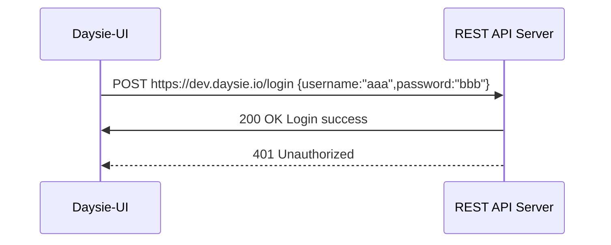
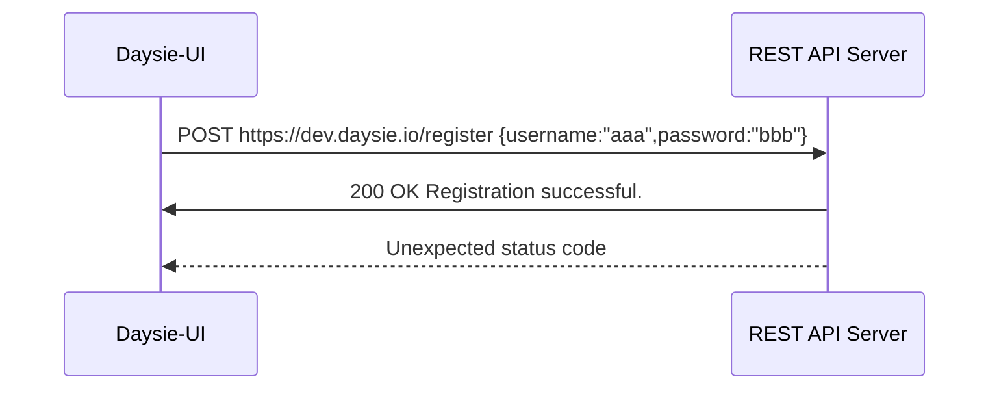
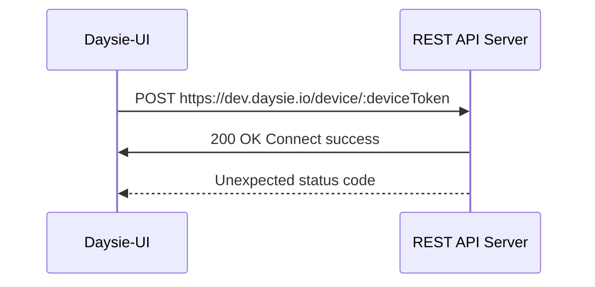
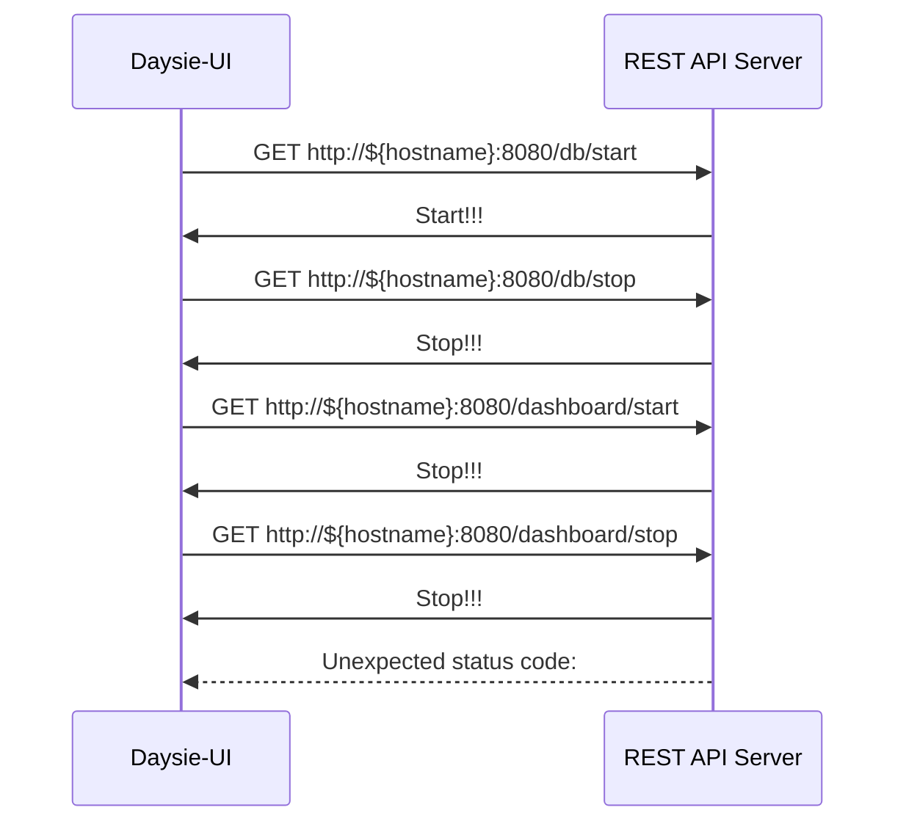
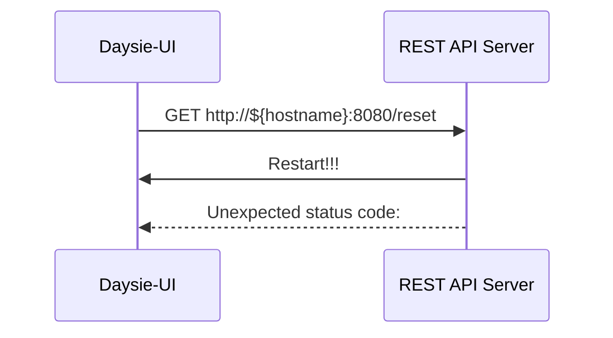

# REST API SERVVER
## Login Page

```mermaid
sequenceDiagram
    participant Daysie-UI
    participant REST API Server
    Daysie-UI ->> REST API Server: POST https://dev.daysie.io/login {username:"aaa",password:"bbb"}

    REST API Server ->> Daysie-UI: 200 OK Login success
    REST API Server -->> Daysie-UI: 401 Unauthorized
```
## Register Page

```mermaid
sequenceDiagram
    participant Daysie-UI
    participant REST API Server
    Daysie-UI ->> REST API Server: POST https://dev.daysie.io/register {username:"aaa",password:"bbb"}

    REST API Server ->> Daysie-UI: 200 OK Registration successful.
    REST API Server -->> Daysie-UI: Unexpected status code
```

## DeviceToken Page

```mermaid
sequenceDiagram
    participant Daysie-UI
    participant REST API Server
    Daysie-UI ->> REST API Server: POST https://dev.daysie.io/device/:deviceToken

    REST API Server ->> Daysie-UI: 200 OK Connect success
    REST API Server -->> Daysie-UI: Unexpected status code
```
# REST API LOCAL
## RecipeConfig Page

```mermaid
sequenceDiagram
    participant Daysie-UI
    participant REST API Server
    Daysie-UI ->> REST API Server: GET http://${hostname}:8080/db/start
    REST API Server ->> Daysie-UI: Start!!!
    Daysie-UI ->> REST API Server: GET http://${hostname}:8080/db/stop
    REST API Server ->> Daysie-UI: Stop!!!
    Daysie-UI ->> REST API Server: GET http://${hostname}:8080/dashboard/start
    REST API Server ->> Daysie-UI: Stop!!!
    Daysie-UI ->> REST API Server: GET http://${hostname}:8080/dashboard/stop
    REST API Server ->> Daysie-UI: Stop!!!

    REST API Server -->> Daysie-UI: Unexpected status code:
```

## AdvanceSetting Page

```mermaid
sequenceDiagram
    participant Daysie-UI
    participant REST API Server
    Daysie-UI ->> REST API Server: GET http://${hostname}:8080/reset
    REST API Server ->> Daysie-UI: Restart!!!
    REST API Server -->> Daysie-UI: Unexpected status code:
```
    